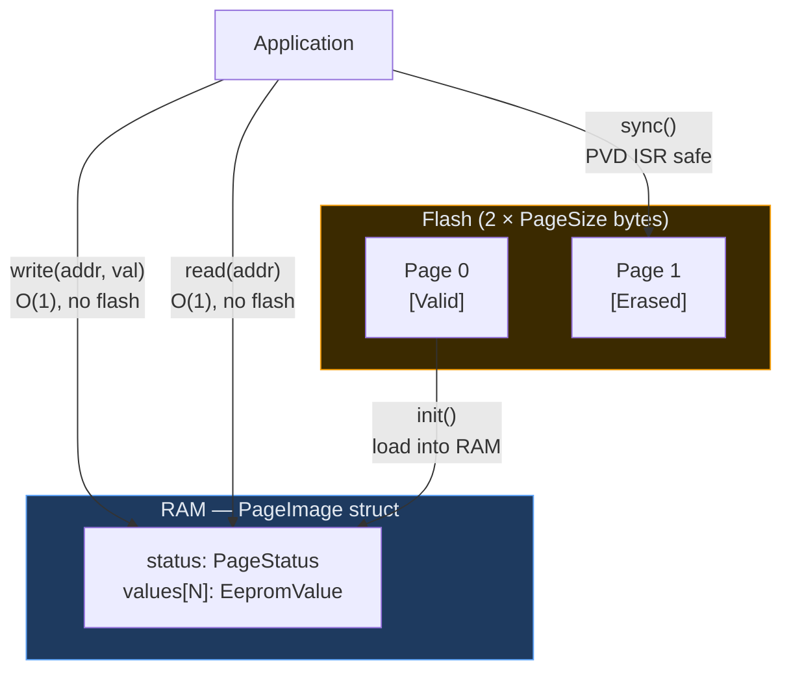
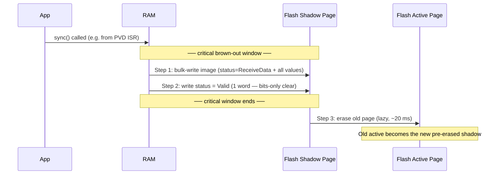
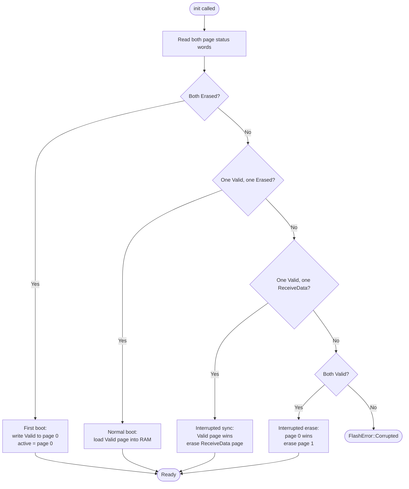
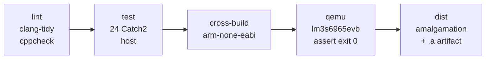

# eepromulation

> C++20 EEPROM emulation in flash — fast writes, brown-out safe sync, zero padding.

A modern C++ port of the STM32 AN2594 EEPROM-in-flash algorithm. Extends the original with a write-back RAM cache and an atomic shadow-page sync designed to be called safely from a PVD brown-out ISR.

---

## How it works

### Architecture



The RAM `PageImage` struct is byte-identical to the flash page layout. `sync()` bulk-writes the whole struct to the pre-erased shadow page in one HAL call — no address fields, no padding, no per-slot overhead.

---

### Flash page layout

```
[ PageStatus 4B ][ val[0] 2B ][ val[1] 2B ] ··· [ val[N-1] 2B ]
 ←——————————————————————— PageSize bytes ————————————————————————→
```

| Field | Size | Notes |
|---|---|---|
| `PageStatus` | 4 bytes | `0xFFFF'FFFF` Erased → `0xFFFF'EEEE` ReceiveData → `0xFFFF'0000` Valid |
| `value[addr]` | 2 bytes | `0xFFFF` = not present. Writing `0xFFFF` is a no-op on flash. |

**Position is the address.** No address field is stored per slot. `value[addr]` holds the data for virtual address `addr`.

PageSize is a compile-time template parameter — 1 KB and 2 KB are supported out of the box:

| PageSize | Virtual addresses | Physical flash used |
|---|---|---|
| 1024 (default, host/QEMU) | 510 | 2 × 1 KB |
| 2048 (STM32WL) | 1022 | 2 × 2 KB |

---

### sync() — the critical path



Steps 1–2 are **writes only** (no erase). On STM32WL one 2 KB page = 2048 bytes / 8 bytes per double-word = **256 × 64-bit writes** ≈ a few milliseconds — well within the hold-up window of a capacitor on the 3.3 V rail.

---

### Power-loss recovery — init() state machine



---

## Project layout

```
include/eeprom/
  types.hpp              — PageStatus, PageImage<PageSize>, EepromValue, Result<T,E>
  hal.hpp                — FlashHal pure-virtual interface + FlashHalConcept
  emulation.hpp          — EepromEmulation<Hal, PageSize> declaration
  emulation_impl.hpp     — template method implementations
  host_flash_hal.hpp     — HostFlashHal<PageSize>  (in-memory, for tests + QEMU)
  stm32wl_flash_hal.hpp  — Stm32WlFlashHal  (64-bit packed writes, PageSize=2048)
  stm32_flash_hal.hpp    — Stm32FlashHal  (generic STM32 stub — implement for your target)
  an2594_compat.h        — C API: EE_Configure / EE_Init / EE_ReadVariable /
                           EE_WriteVariable / EE_Sync / EE_Format
src/
  emulation.cpp          — explicit instantiation placeholder
  an2594_compat.cpp      — C wrapper backed by HostFlashHal (host/QEMU default)
  hal/host/              — thin compilation unit for HostFlashHal
  hal/stm32/             — Stm32FlashHal stub (fill in for your target)
tests/
  test_emulation.cpp     — 24 Catch2 tests (host build)
target/                  — QEMU lm3s6965evb demo (Cortex-M3, semihosting)
examples/stm32wl/
  startup.s              — Cortex-M4 vector table + reset handler (shared)
  stm32wl.ld             — Linker script — FLASH + EEPROM memory regions (configurable placement)
  cpp/                   — C++20 API demo  → stm32wl_cpp.elf
  c/                     — C API demo      → stm32wl_c.elf
    stm32wl_compat.cpp   — C++ glue that backs EE_* with Stm32WlFlashHal
cmake/
  warnings.cmake
  arm-none-eabi-toolchain.cmake   — Cortex-M3 (lm3s6965evb)
  stm32wl-toolchain.cmake         — Cortex-M4, soft-float (STM32WL)
```

---

## Getting started

### Prerequisites — Nix (recommended)

```sh
nix develop
```

Drops into a shell with clang, arm-none-eabi-gcc, cmake, ninja, qemu, catch2, cppcheck, clang-tools, python3.

### Prerequisites — manual

- CMake ≥ 3.25, Ninja
- clang + clang-tools (clang-tidy, clang-format)
- arm-none-eabi-gcc ≥ 12 (C++20 support required)
- qemu-system-arm
- Catch2 v3

---

## Using this library in your project

### Add via CMake FetchContent

```cmake
include(FetchContent)
FetchContent_Declare(
  eepromulation
  GIT_REPOSITORY https://github.com/your-org/eepromulation.git
  GIT_TAG        main
)
FetchContent_MakeAvailable(eepromulation)

target_link_libraries(your_target PRIVATE eeprom_emulation eeprom_headers)
```

For the C API also link `eeprom_an2594_compat` (or use your own compat file — see below).

---

### C++ API

```cpp
#include "eeprom/emulation.hpp"
#include "eeprom/stm32wl_flash_hal.hpp"   // or your own HAL

eeprom::Stm32WlFlashHal hal;              // default: pages 126 & 127
eeprom::EepromEmulation<eeprom::Stm32WlFlashHal, 2048U> emu{hal};

emu.init();                  // call once on boot — handles first-boot automatically

emu.write(42, 0xABCD);       // RAM only — instant, no flash wear
auto r = emu.read(42);       // RAM only — O(1)
if (r.is_ok()) { /* r.value() == 0xABCD */ }

emu.sync();                  // flush to flash — call from PVD ISR or periodically

emu.format();                // wipe everything — for factory reset
```

Unwritten addresses read back as `0xFFFF` (`kValueNotPresent`).
Writing `0xFFFF` to an address succeeds but is a no-op on flash.

---

### Drop-in C integration — release artifacts

Every tagged release ships three files. Download them from the GitHub Releases
page and pick the integration path that suits your build system.

| File | Target | Notes |
|---|---|---|
| `eeprom.h` | all | C header — include in your sources |
| `libeepromulation_stm32wl.a` | Cortex-M4, Thumb, soft-float | Prebuilt — **no C++ toolchain needed** |
| `eepromulation.cpp` | any ARM target | Amalgamated source — compile once with C++20 |

Both options expose the same C API and support `EE_Configure` for runtime page
placement — no source editing required.

---

#### Option A — prebuilt `.a` (recommended, pure C)

Copy `eeprom.h` and `libeepromulation_stm32wl.a` into your project tree, then
add one call before `EE_Init`:

```c
#include "eeprom.h"

void system_init(void) {
    EE_Configure(62, 63);   /* STM32WL55JBxx — omit for JCxx default (126, 127) */
    EE_Init();
}
```

**Makefile**

```makefile
CC      = arm-none-eabi-gcc
CFLAGS  = -mcpu=cortex-m4 -mthumb -mfloat-abi=soft -Os
LDFLAGS = -T your_board.ld -L$(LIB_DIR) -leepromulation_stm32wl --specs=nosys.specs

your_app.elf: main.o
	$(CC) $^ $(LDFLAGS) -o $@
```

No C++ flag, no `g++`, no `libstdc++`. The C++ is already compiled into the `.a`.

**CMake**

```cmake
add_library(eepromulation_stm32wl IMPORTED STATIC)
set_target_properties(eepromulation_stm32wl PROPERTIES
    IMPORTED_LOCATION ${CMAKE_CURRENT_SOURCE_DIR}/lib/libeepromulation_stm32wl.a
    INTERFACE_INCLUDE_DIRECTORIES ${CMAKE_CURRENT_SOURCE_DIR}/include
)

target_link_libraries(your_target PRIVATE eepromulation_stm32wl)
```

**STM32CubeIDE**

1. Copy `eeprom.h` into `Core/Inc/` (or any directory on your include path).
2. Copy `libeepromulation_stm32wl.a` into a `Lib/` folder in your project.
3. Project → Properties → C/C++ Build → Settings → MCU GCC Linker:
   - **Libraries** (`-l`): add `eepromulation_stm32wl`
   - **Library search path** (`-L`): add `${workspace_loc:/${ProjName}/Lib}`
4. Build — done.

---

#### Option B — amalgamated source (compile it yourself)

Use `eepromulation.cpp` when you need to target a different ABI (e.g.
hard-float, Cortex-M0) or change the compile-time page defaults with `-D`.

Copy `eeprom.h` and `eepromulation.cpp` into your project, then compile the
`.cpp` file as C++20. Everything else stays C.

**Makefile**

```makefile
CXX     = arm-none-eabi-g++
CC      = arm-none-eabi-gcc
CXXFLAGS = -mcpu=cortex-m4 -mthumb -mfloat-abi=soft -std=c++20 -Os
CFLAGS   = -mcpu=cortex-m4 -mthumb -mfloat-abi=soft -Os

# Compile the C++ glue
eepromulation.o: eepromulation.cpp
	$(CXX) $(CXXFLAGS) -c $< -o $@

# Link with g++ as driver so libstdc++ is pulled in automatically
your_app.elf: main.o eepromulation.o
	$(CXX) $^ -T your_board.ld --specs=nosys.specs -o $@
```

To change page defaults without calling `EE_Configure`:

```makefile
CXXFLAGS += -DEEPROM_PAGE0_IDX=62 -DEEPROM_PAGE1_IDX=63
```

**CMake**

```cmake
target_sources(your_target PRIVATE eepromulation.cpp)

# Tell CMake this .cpp file must be compiled as C++20
set_source_files_properties(eepromulation.cpp PROPERTIES LANGUAGE CXX)
set_property(TARGET your_target PROPERTY CXX_STANDARD 20)

# Use g++ as the linker driver so libstdc++ is linked automatically
set_target_properties(your_target PROPERTIES LINKER_LANGUAGE CXX)
```

**STM32CubeIDE**

1. Copy `eeprom.h` into `Core/Inc/` and `eepromulation.cpp` into `Core/Src/`.
2. Right-click `eepromulation.cpp` → Properties → C/C++ Build → Tool Chain Editor:
   set compiler to **ARM Cross G++ Compiler**.
3. Project → Properties → C/C++ Build → Settings → MCU G++ Compiler → Dialect:
   set **Language standard** to `ISO C++20`.
4. Project → Properties → C/C++ Build → Settings → MCU GCC Linker → General:
   check **Use G++ linker** (ensures `libstdc++` is linked).
5. Build.

---

### C API on STM32WL — build from source

Use this path if you are building directly from the repository (e.g. via CMake
FetchContent or as a submodule) rather than downloading release artifacts.
The C API is the same as Options A and B above: `EE_Configure` / `EE_Init` /
`EE_ReadVariable` / `EE_WriteVariable` / `EE_Sync` / `EE_Format`.

#### Step 1 — add the files to your project

Copy these two files into your project:

| File | What it does |
|---|---|
| `include/eeprom/an2594_compat.h` | C header — include this in your C sources |
| `examples/stm32wl/c/stm32wl_compat.cpp` | C++ glue — add this as a source file |

You do **not** need `src/an2594_compat.cpp` — `stm32wl_compat.cpp` replaces it.

#### Step 2 — configure flash page placement

The EEPROM pages can go **anywhere** in flash. The recommended way is to call
`EE_Configure()` at runtime before `EE_Init()`:

```c
/* Place EEPROM on pages 62-63 (STM32WL55JBxx, 128 KB) */
EE_Configure(62, 63);
EE_Init();
```

| Variant | Flash | `EE_Configure` call |
|---|---|---|
| STM32WL55JCxx | 256 KB | `EE_Configure(126, 127)` *(or omit — this is the default)* |
| STM32WL55JBxx | 128 KB | `EE_Configure(62, 63)` |
| STM32WL55JAxx |  64 KB | `EE_Configure(30, 31)` |
| Any two pages | — | `EE_Configure(N, N+1)` |

If you never call `EE_Configure`, pages 126 and 127 are used (last 4 KB of a
256 KB STM32WL55JCxx). The defaults can also be changed at compile time without
source editing — useful when using the prebuilt `.a` is not an option:

```cmake
target_compile_definitions(your_target PRIVATE
    EEPROM_PAGE0_IDX=62
    EEPROM_PAGE1_IDX=63
)
```

Either way, the page indices must match the `EEPROM` region in your linker
script. Update `EEPROM ORIGIN` and `FLASH LENGTH` in `stm32wl.ld` to match:

```ld
/* Default — last 4 KB of 256 KB device (pages 126-127): */
FLASH  (rx) : ORIGIN = 0x08000000, LENGTH = 252K
EEPROM (r)  : ORIGIN = 0x080FC000, LENGTH = 4K

/* 128 KB device, last 4 KB (pages 62-63): */
FLASH  (rx) : ORIGIN = 0x08000000, LENGTH = 124K
EEPROM (r)  : ORIGIN = 0x0801F000, LENGTH = 4K
```

The `.eeprom_reserved (NOLOAD)` section in `stm32wl.ld` makes the linker error
if code would overlap the EEPROM region.

#### Step 3 — build with C++20

`stm32wl_compat.cpp` is C++, so your build must:

```cmake
# CMake — compile the compat file as C++20
target_sources(your_target PRIVATE stm32wl_compat.cpp)
set_source_files_properties(stm32wl_compat.cpp
    PROPERTIES LANGUAGE CXX)
set_property(TARGET your_target PROPERTY CXX_STANDARD 20)

# Use g++ as linker driver (pulls in libstdc++ automatically)
set_target_properties(your_target PROPERTIES
    LINKER_LANGUAGE CXX)
```

Or with a plain Makefile, compile with `arm-none-eabi-g++` and link with `arm-none-eabi-g++`.

#### Step 4 — call from C

```c
#include "eeprom/an2594_compat.h"

void app_init(void) {
    /* Optional: call EE_Configure before EE_Init to place EEPROM on specific
     * pages. If omitted, the defaults (126, 127) are used. */
    EE_Configure(62, 63);   /* STM32WL55JBxx — remove for JCxx default */

    /* EE_Init handles first boot automatically — no EE_Format needed */
    if (EE_Init() != EE_OK) { /* handle error */ }
}

void app_save(void) {
    EE_WriteVariable(0x0001, sensor_value);
    EE_WriteVariable(0x0002, config_flags);
    EE_Sync();   /* persist to flash — call from PVD ISR or at safe points */
}

void app_load(void) {
    uint16_t val;
    if (EE_ReadVariable(0x0001, &val) == EE_OK) { sensor_value = val; }
    if (EE_ReadVariable(0x0002, &val) == EE_OK) { config_flags = val; }
}

void factory_reset(void) {
    EE_Format();   /* erase both pages — all values lost */
    /* EE_Init() is not required after EE_Format — emulator is immediately ready */
}
```

#### Return codes

| Code | Value | Meaning |
|---|---|---|
| `EE_OK` | 0x0000 | Success |
| `EE_NOT_FOUND` | 0x00CD | Address never written (or written with 0xFFFF) |
| `EE_PAGE_FULL` | 0x0080 | No space left (should not occur with this design) |
| `EE_NO_VALID_PAGE` | 0x00AB | Flash error or corruption |

#### Virtual address range

With `PageSize = 2048` (the STM32WL HAL default): addresses **0 – 1021** (1022 total).

---

### Implementing a HAL for a different STM32

Subclass `eeprom::FlashHal` and implement four methods:

```cpp
#include "eeprom/hal.hpp"
#include <span>

class MyFlashHal : public eeprom::FlashHal {
public:
    // Erase one logical page (set all bytes to 0xFF)
    eeprom::Result<void> erase_page(eeprom::PageIndex page) override;

    // Bulk-write a full page image (called once per sync).
    // HAL decides physical write granularity (32-bit, 64-bit, etc.)
    eeprom::Result<void> write_page(eeprom::PageIndex page,
                                    std::span<const std::byte> data) override;

    // Write a single 32-bit word — called only for the status promotion
    // at the end of sync (ReceiveData → Valid at offset 0).
    eeprom::Result<void> write_word(eeprom::PageIndex page,
                                    std::uint32_t offset,
                                    eeprom::FlashWord data) override;

    // Read a 32-bit word (flash is memory-mapped on STM32 — direct pointer read)
    eeprom::Result<eeprom::FlashWord> read_word(eeprom::PageIndex page,
                                                std::uint32_t offset) const override;

    std::uint32_t page_size()  const noexcept override { return /* bytes per logical page */; }
    std::uint32_t page_count() const noexcept override { return eeprom::kPageCount; }  // always 2
};
```

`offset` is always a byte offset within the page, and always a multiple of 4.

See `include/eeprom/stm32wl_flash_hal.hpp` for a complete example with 64-bit double-word writes.

---

## Building & testing

```sh
# Configure and build (host)
cmake --preset host-debug
cmake --build build/host-debug

# Run 24 tests
ctest --preset host-debug --output-on-failure

# Lint
cmake --build build/host-debug --target clang-tidy
cmake --build build/host-debug --target cppcheck

# Cross-compile QEMU demo (Cortex-M3)
cmake --preset arm-debug
cmake --build build/arm-debug

# Run in QEMU
qemu-system-arm \
  -M lm3s6965evb \
  -kernel build/arm-debug/target/demo.elf \
  -semihosting -nographic -no-reboot

# Cross-compile STM32WL examples (Cortex-M4)
cmake --preset stm32wl-debug
cmake --build build/stm32wl-debug
# Flash (convert to binary first, then write):
# arm-none-eabi-objcopy -O binary build/stm32wl-debug/examples/stm32wl/c/stm32wl_c.elf stm32wl_c.bin
# st-flash write stm32wl_c.bin 0x08000000
```

---

## CI



Runs on every push and pull request. On a `v*` tag, the `dist` job also creates a GitHub Release with `eeprom.h`, `eepromulation.cpp`, and `libeepromulation_stm32wl.a`.

---

## References

- [AN2594](https://www.st.com/resource/en/application_note/an2594-eeprom-emulation-in-stm32f10x-microcontrollers-stmicroelectronics.pdf) — STM32F10x EEPROM Emulation Application Note
- [RM0453](https://www.st.com/resource/en/reference_manual/rm0453-stm32wl5x-advanced-armbased-32bit-mcus-stmicroelectronics.pdf) — STM32WL5x Reference Manual (flash controller §3)
- [QEMU lm3s6965evb](https://www.qemu.org/docs/master/system/arm/stellaris.html) — QEMU Stellaris board documentation
